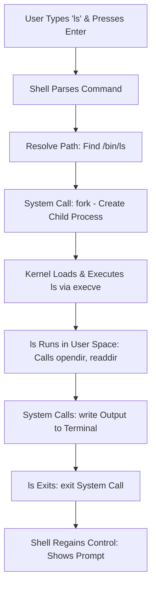

## Core Components of Linux
Linux is structured in layers, from hardware to user applications. Here's a high-level overview:

```
+----------------------------------------------------+
| User Applications (Vim, Docker, Apache, etc.)     |
+----------------------------------------------------+
| Shell (Bash, Zsh, Fish, etc.)                     |  <-- Part of the OS
+----------------------------------------------------+
| System Libraries (glibc, libc, OpenSSL, etc.)     |  <-- Part of the OS
+----------------------------------------------------+
| System Utilities (ls, grep, systemctl, etc.)      |  <-- Part of the OS
+----------------------------------------------------+
| Linux Kernel (Process, Memory, FS, Network)       |  <-- Core of the OS
+----------------------------------------------------+
| Hardware (CPU, RAM, Disk, Network, Peripherals)   |
+----------------------------------------------------+
```
### (1) Hardware Layer.
- Hardware layer consists of physical components such as CPU, RAM, Network interfaces, Disk, etc..
- The OS interacts with hardware via device drivers in the kernel

### (2) Kernel - The core of the Linux OS
- **Manages system resources directly:**
  - **Memory Management:** The kernel tracks, allocates, and deallocates system memory, ensuring that each process gets access without interfering with others.
  - **Process Management:** Manage processes, controlling which programs get CPU for how long, enabling multitasking.
  - **Device Management:** Device drivers in the kernel provide a unified interface for hardware devices, translating software requests into hardware actions.
  - **File System Management:** Handles storage, retrieval, and Permissions. Also support multiple FS.
  - **Network Management:** Manages network interface and protocols, allowing communication between networks.
  - **System Calls and Security:** Application requests kernel service via system calls, and the kernel enforces permissions and security policies.
- **Kernel Space VS User Space:**
  - **Kernel Space:** Protected memory area where the core part of the kernel, device drivers, and related extensions run. It has full unrestricted access to all hardware and system resources. A isolated space to keep the system safe and stable.
  - **User Space:** Memory area where the user application runs. It has limited access to the memory and can not directly interact with the Hardware. Its the restricted environment to prevent them from harming the system.
  - **Why this separation:** The main reason is security and stability.
  - **System Calls:** user-space programs cannot directly access the hardware or kernel memory. System call is a safe way to ask the kernel to perform a privileged operation on their behalf.
- **Kernel Version:** Numbered as X.Y.Z (e.g., 5.15.0) where X=major, Y=minor, Z=patch.
- **Monolithic Kernel:** Core system services run together in  kernel space. Fast and less isolated.

### (3) Shell - Command Line Interface (CLI)
- Shell/Command interpreter converts user commands into system calls.
- Few Shell examples are `Bash`, `ZSH`, `Dash`, `Ksh`.
- Essential for DevOps/SRE/Platform Engg scripting and automation.

#### What Happens When You Run a  Command? (Example: `ls`)
Let's break down, in very simple steps, what happens when you type a command like `ls` and press Enter in a Linux terminal:

1. **You Type the Command:** You type `ls` (which lists files in your current directory) in the terminal and hit Enter.
2. **The Shell Reads Your Input:** The shell (like Bash or Zsh) reads the command you entered.
3. **Shell Finds the Program:** The shell searches for what `ls` means by checking the directories listed in your `$PATH` variable via system call (`access()`). If it finds an executable program called ls, it continues.​
4. **A New Process is Created:** The shell asks the operating system to start a new process (child process) for the `ls` command using a system call called (`fork()`). Each running program in Linux is a process, which is an instance of a program in memory.​
5. **The Kernel Gets Involved:** The shell can't control the hardware directly. So, it asks the kernel (using a system call `execve()`) to load and run the program for `ls`.
6. **The ls Program Runs:** The kernel loads the `ls` program into memory and starts running it as a new process. `ls` does its job: it reads the directory contents, often by making more system calls (e.g., `opendir()` to open the directory, `readdir()` to read entries) to the kernel to access the file system.
7. **Output is Shown:** Once `ls` gets the list of files, it formats and prints the result to your terminal window using kernel system calls (`write()`)
8. **Process Ends:** When `ls` finishes its work, the process ends (`exit()` system call), and the shell gives you a new prompt to type another command.

This process highlights the shell-kernel handoff, ensuring secure and efficient execution. In DevOps, understanding this enables better debugging of scripts and automation.



### (4) User Applications and System Utilities
- **User Applications:** End-user programs like web browsers, text editors (Vim), DevOps tools (Docker, Ansible), and servers (Apache). Interact with the OS via system calls through the shell or GUI.
- **System Utilities:** Core commands (e.g., ls, grep, systemctl) for system interaction, provided by the GNU Project.
- **File System:** Organizes data in a hierarchical structure; everything is a file.
- **Processes:** Running instances of programs, managed by the kernel.
- **Init System:** Manages system startup and services (systemd, SysVinit).
