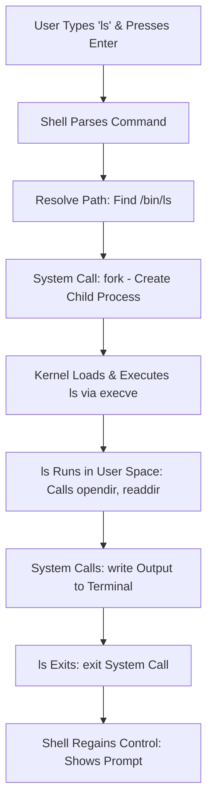

## Core Components of Linux
Linux is structured in layers, from hardware to user applications. Here's a high-level overview:

```
+----------------------------------------------------+
| User Applications (Vim, Docker, Apache, etc.)     |
+----------------------------------------------------+
| Shell (Bash, Zsh, Fish, etc.)                     |  <-- Part of the OS
+----------------------------------------------------+
| System Libraries (glibc, libc, OpenSSL, etc.)     |  <-- Part of the OS
+----------------------------------------------------+
| System Utilities (ls, grep, systemctl, etc.)      |  <-- Part of the OS
+----------------------------------------------------+
| Linux Kernel (Process, Memory, FS, Network)       |  <-- Core of the OS
+----------------------------------------------------+
| Hardware (CPU, RAM, Disk, Network, Peripherals)   |
+----------------------------------------------------+
```
### (1) Hardware Layer.
- Hardware layer consists of physical components such as CPU, RAM, Network interfaces, Disk, etc..
- The OS interacts with hardware via device drivers in the kernel

### (2) Kernel - The core of the Linux OS
- **Manages system resources directly:**
  - **Memory Management:** The kernel tracks, allocates, and deallocates system memory, ensuring that each process gets access without interfering with others.
  - **Process Management:** Manage processes, controlling which programs get CPU for how long, enabling multitasking.
  - **Device Management:** Device drivers in the kernel provide a unified interface for hardware devices, translating software requests into hardware actions.
  - **File System Management:** Handles storage, retrieval, and Permissions. Also support multiple FS.
  - **Network Management:** Manages network interface and protocols, allowing communication between networks.
  - **System Calls and Security:** Application requests kernel service via system calls, and the kernel enforces permissions and security policies.
- **Kernel Space VS User Space:**
  - **Kernel Space:** Protected memory area where the core part of the kernel, device drivers, and related extensions run. It has full unrestricted access to all hardware and system resources. A isolated space to keep the system safe and stable.
  - **User Space:** Memory area where the user application runs. It has limited access to the memory and can not directly interact with the Hardware. Its the restricted environment to prevent them from harming the system.
  - **Why this separation:** The main reason is security and stability.
  - **System Calls:** user-space programs cannot directly access the hardware or kernel memory. System call is a safe way to ask the kernel to perform a privileged operation on their behalf.
- **Kernel Version:** Numbered as X.Y.Z (e.g., 5.15.0) where X=major, Y=minor, Z=patch.
- **Monolithic Kernel:** Core system services run together in  kernel space. Fast and less isolated.

### Shell - Command Line Interface (CLI)
- Shell/Command interpreter converts user commands into system calls.
- Few Shell examples are `Bash`, `ZSH`, `Dash`, `Ksh`.
- Essential for DevOps/SRE/Platform Engg scripting and automation.

#### What Happens When You Run a  Command? (Example: `ls`)
When you type a command like `ls` (to list directory contents) and press Enter, the shell orchestrates a multi-step process involving user space and kernel space. Here's a step-by-step breakdown:

1. **User Input:** You type `ls` in the terminal and press Enter. The terminal captures this as input.
2. **Shell Parsing:** The shell (e.g., Bash) reads the command, parses it (checks for arguments, aliases, or built-ins), and determines it's an external program (`/bin/ls`).
3. **Path Resolution:** The shell searches the `$PATH` environment variable for the executable (e.g., finds `/bin/ls`).
4. **Process Creation:** The shell uses a system call (`fork()`) to create a child process for `ls`.
5. **Kernel Execution:** The kernel switches to kernel mode, loads `/bin/ls` into memory (via `execve()` system call), and starts execution in user space.
6. **Command Execution:** `ls` runs in user space, makes system calls (e.g., `opendir()` to open the directory, `readdir()` to read entries) to interact with the file system via the kernel.
7. **Output Generation:** `ls` formats the output (e.g., file names) and writes it to stdout using kernel system calls (`write()`).
8. **Process Termination:** `ls` exits, the child process ends (`exit()` system call), and the shell regains control, displaying the prompt.

This process highlights the shell-kernel handoff, ensuring secure and efficient execution. In DevOps, understanding this enables better debugging of scripts and automation.


